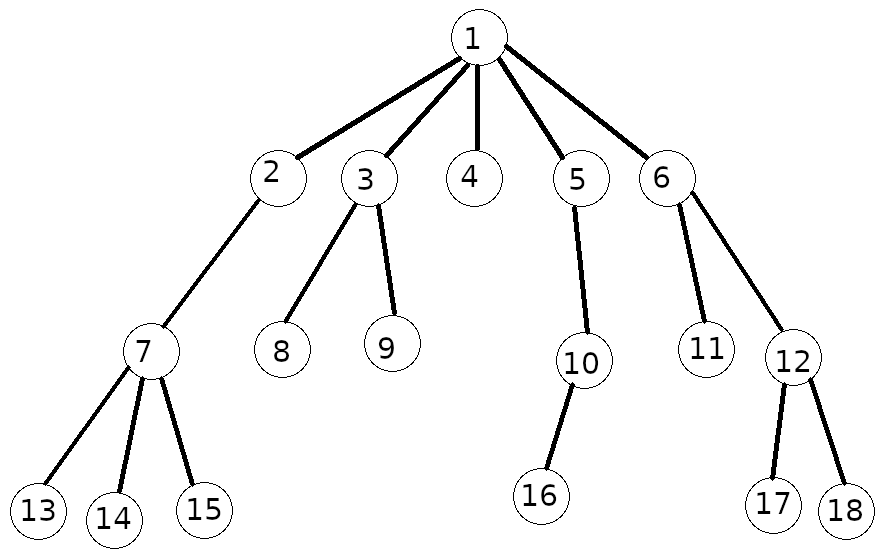
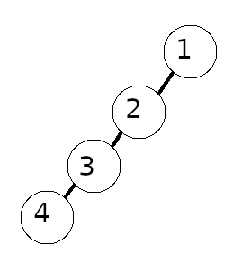

## Description of involved data structures and concepts
This problem statement is meant to be accessible to new programmers who do not have that much experience with Data Structures.  If you feel confident that you understand these data structures and concepts feel free to ignore this section

### Trees
Trees are a very useful data structure used in many places within Computer Science.  A "generalized tree" consists of nodes that can have any number of child nodes. There is only one root node which is the node at the "top" of the tree which does not have a parent node.  Otherwise, all nodes have one and only one parent node.  
Below is an example of a binary tree:  
  

As you can see in the example above: node 1 has 5 children, node 7 has 3 children, nodes 3 and 12 have 2 children,  nodes 2, 4, 5, and 10 have one child and the nodes 4, 8, 9, 11, 13, 14, 15, 16, 17, and 18 are leaf nodes (have no children).  Node 1 is the root in this tree.  

The formal definition of a tree is a set on nodes **N** and a set of parent-child relationships (*parent*,*child*) **R** such that: 
1) There is one and only one node *root* which has no parent.
2) For all nodes in **N** except the node *root* each node has one and only one parent.

It is important to note that there are some trees that "don't look like trees" at least at first glance.  
Consider The tree below:  
  
It doesn't look "branchy" or "tree like", however it is still a tree since it meets the requirements of a tree.  Node 1 is the root and parent of node 2. Node 2 is the parent of node 3.  Node 3 is the parent of node 4, and node 4 is the only leaf node in this tree.  I also want to not that a single isolated node counts as a tree since is meets the formal requirements for a tree.
