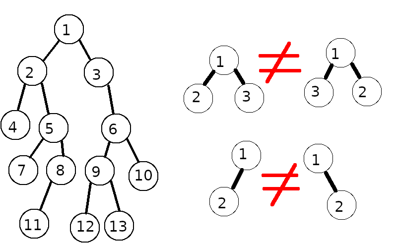

# Binary Tree Reconstruction

## Description of involved data structures and concepts
This problem statement is meant to be accessible to new programmers who do not have that much experience with Data Structures.  If you feel confident that you understand these data structures and concepts feel free to ignore this section

### Trees
Trees are a very useful data structure used in many places within Computer Science.  A "generalized tree" consists of nodes that can have any number of child nodes. There is only one root node which is the node at the "top" of the tree which does not have a parent node.  Otherwise, all nodes have one and only one parent node.  
Below is an example of a binary tree:  
  

As you can see in the example above: node 1 has 5 children, node 7 has 3 children, nodes 3 and 12 have 2 children,  nodes 2, 4, 5, and 10 have one child and the nodes 4, 8, 9, 11, 13, 14, 15, 16, 17, and 18 are leaf nodes (have no children).  Node 1 is the root in this tree.  

The formal definition of a tree is a set on nodes **N** and a set of parent-child relationships (*parent*,*child*) **R** such that: 
1) There is one and only one node *root* which has no parent.
2) For all nodes in **N** except the node *root* each node has one and only one parent.

It is important to note that there are some trees that "don't look like trees" at least at first glance.  
Consider The tree below:  
  
It doesn't look "branchy" or "tree like", however it is still a tree since it meets the requirements of a tree.  Node 1 is the root and parent of node 2. Node 2 is the parent of node 3.  Node 3 is the parent of node 4, and node 4 is the only leaf node in this tree.  I also want to not that a single isolated node counts as a tree since is meets the formal requirements for a tree.

#### Binary Trees
In a binary tree there is one further restriction on a tree compared to the "generalized" tree.  Each node can have no more than two children.  It is also important to note that the orientation of the children as right or left child also matters.  
  
In the above example the there is a tree to the left which is considered a binary tree because it respects the limit of each node having at most two children.  To the right there is an illustration ofthe order/oritenation nodes matters in a tree.

### Traversals of trees
There are two main ways of traversing any type of tree.  They are the pre-order traversal, and post-order traversal.  There is also another type of traversal called the in-order trversal that applies to binary trees.
#### Pre-order traversal
In a pre-order traversal the traversal visits the parent first and then traverses the left and right children.  When traversing the left and right chilren the traversal visits the node in question first and then traverses its left and right children.  
Below is come pseudo-code for pre-order traversal:  
```
preOrderTraverseTree( t )/t is the tree object which contains the nodes including the root node
{
	preOrderTraverse(g.rootNode)
}

preOrderTraverse( n )//n is a node in the graph
{
	visit(n)
	preOrderTraverse( n.leftChild  )
	preOrderTraverse( n.rightChild )
}

visit( n )// performs some action using the data in the node(in this case we print out the nodes id)
{
	print(n.id)
}
```
If this pseudo code were used to traverse the example binary tree above the result would be:  
```1,2,4,5,7,8,11,3,6,9,12,13,10```

#### Post-order traversal
In a post-order traversal the traversal traverses the left and right children **first** and only then visits the parent.  When traversing the left and right chilren the traversal first traverses the node in questions children and only then visits the node.  
Below is come pseudo-code for post-order traversal:  
```
postOrderTraverseTree( t )//t is the tree object which contains the nodes including the root node
{
	postOrderTraverse(g.rootNode)
}

postOrderTraverse( n )//n is a node in the graph
{
	preOrderTraverse( n.leftChild  )
	preOrderTraverse( n.rightChild )
	visit(n)
}

visit( n )// performs some action using the data in the node(in this case we print out the nodes id)
{
	print(n.id)
}
```
If this pseudo code were used to traverse the example binary tree above the result would be:  
```4,7,11,8,5,2,12,13,9,10,6,3,1```

## Problem Statement
Any binary tree can be fully reconstructed from the conbination of its pre and post orders. The challenge is as follows:  
1) Show that the previous statement is true.  You don't need a formal proof, but you do need an explanation for why it is true.
2) Write a program that takes it two strings which constitute the pre and post order of some tree and reconstructs the tree from those strings and no other information about the tree.
3) Show that this claim above also applies to trinary trees(trees with at most 3 child nodes)
4) Extend the aforementioned program to be able to reconstruct trinary trees from their pre and post orders.
5) Show that this claim above also applies to generalized trees (trees where a node may have any number of children.)
6) (optional) Write a program that can reconstruct any tree from its pre and post order.


